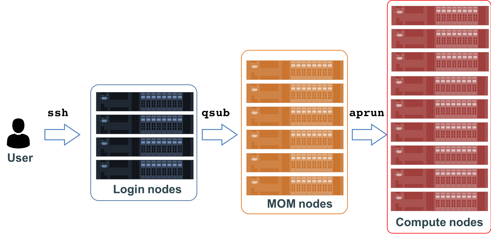

## A Closer Look at the Blue Waters nodes

Before we learn how to launch jobs on Blue Waters,
let's take a closer look at its structure.

As you already know, when we connect to Blue Waters _via_ `ssh` command we land on one
of three login nodes. Here we can take care of all input data and compile our application.
However, we can not simply execute our science  application there. Instead, we have to:

1. Prepare the so-called _job batch script_ that sets up the execution environment
2. Submit the job to the queue
3. From within that script, send the application for execution on the compute nodes

## Job script

Blue Waters uses **Portable Batch System** (**PBS**) to handle scheduling on jobs.  A job script is
a simple Shell script that you want to be executed by the system on the MOM nodes.  It contains
special instructions for the queuing system about the requested resources, account to be charged,
job name, and _etc._ The script must have an `aprun` command that sends an application for the
execution on the compute nodes.

Please copy the following directory to your home folder: `~mbelkin/new-user-training`.
This directory contains two simple batch scripts (`*.pbs`) and a `src` directory with
a few programs.

## Submitting a job

To submit your job script for the execution on the Blue Water compute nodes
to the queue, use the `qsub` command:
~~~
$ qsub jobscript.sh
~~~
{: .language-bash}

To check the status of your job, use `qstat` command:
~~~
$ qstat
$ qstat -f
$ qstat -u $USER
~~~
{: .language-bash}

To postpone execution, release the hold, or remove your job from the queue, use `qhold`, `qrls`, and
`qdel` commands, correspondingly:
~~~
$ qhold <JOBID>
$ qdel <JOBID>
$ checkjob <JOBID>
~~~
{: .language-bash}

## Backfill

If you would like your job to start sooner you might be interested in backfill opportunities:

~~~
$ showbf -f xk
# or
$ showbf -f xe
~~~
{: .language-bash}

